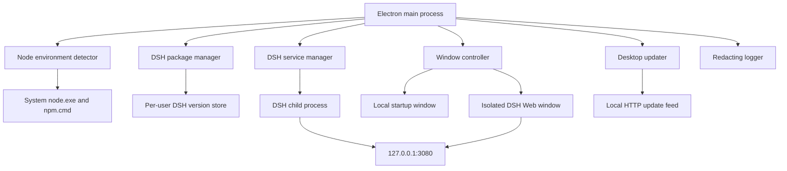
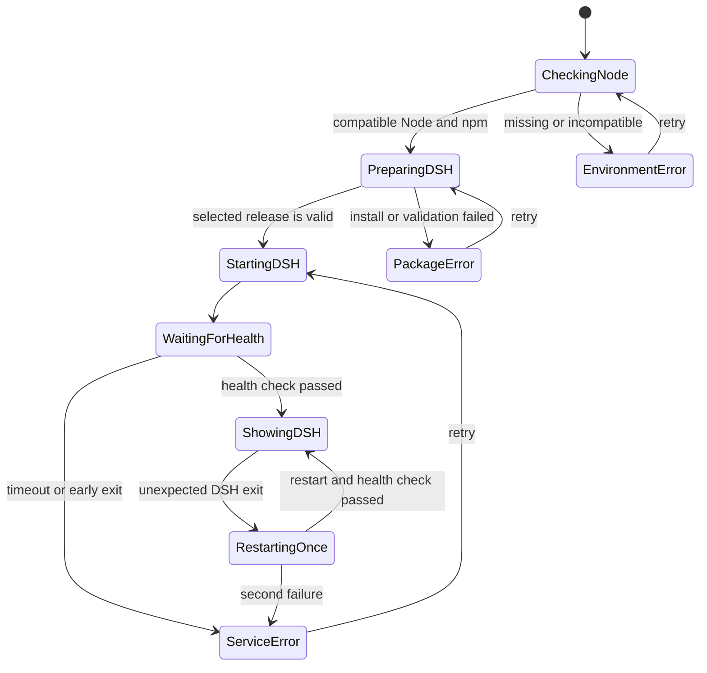

# DSH Desktop for Windows Design

## 1. Summary

Build a Windows desktop wrapper for DeepSeek Harness Web UI. The application
uses Electron to validate the user's system Node.js installation, install and
manage a pinned `@deepseek-ai/dsh` package, start `dsh web`, and display the
unchanged DSH Web UI in a secured Electron window.

The first release supports independent updates for the desktop application and
DSH. Desktop updates use a local test feed initially. DSH updates use npm,
install each release alongside the current release, and automatically restore
the previous release when the new service fails its health check.

## 2. Goals

- Provide a Windows x64 installer and a normal desktop application experience.
- Preserve the upstream DSH Web UI instead of maintaining a fork.
- Use the system `node.exe` and `npm.cmd`; do not bundle Node.js for DSH.
- Start DSH automatically and show useful progress before loading its Web UI.
- Stop the complete DSH process tree when the application window closes.
- Update the desktop application and DSH through independent workflows.
- Support an end-to-end local desktop update feed for development and testing.
- Keep one previously working DSH release and restore it after a failed update.
- Produce diagnostic logs without persisting API keys.

## 3. Non-goals for the First Release

- Reimplementing or visually modifying the DSH Web UI.
- Supporting macOS or Linux.
- Running in the system tray after the main window closes.
- Bundling or automatically installing Node.js.
- Hosting a production update service or publishing to GitHub Releases.
- Automatically rolling back a successfully installed desktop application
  release. Installer failures must leave the existing release usable; recovery
  from a defective but successfully installed release uses its prior installer.
- Changing DSH source code or its persisted data formats.

## 4. Confirmed Product Decisions

| Area | Decision |
| --- | --- |
| Initial platform | Windows x64 |
| Desktop framework | Electron with TypeScript |
| DSH interface | Unmodified upstream Web UI |
| Node.js | User-managed system installation |
| Desktop updates | Supported through a local test feed initially |
| DSH updates | Supported through npm with automatic service rollback |
| Close behavior | Closing the main window stops DSH and exits |
| Installer | Per-user NSIS installer without an administrator requirement |

## 5. Runtime Architecture



### 5.1 Electron Main Process

The main process owns all privileged behavior:

- acquire Electron's single-instance lock;
- create and replace application windows;
- discover Node.js and npm;
- install and select DSH releases;
- start, monitor, restart, and stop DSH;
- perform desktop and DSH update workflows;
- write redacted logs; and
- coordinate shutdown.

Only the main process may create operating-system processes or modify the DSH
version store.

### 5.2 Window Controller

The application uses two distinct renderer configurations.

1. A packaged local startup window shows environment checks, installation,
   service startup, and errors. Its preload exposes only typed startup actions
   such as `retry`, `openNodeDownload`, and `openLogs`.
2. After the DSH health check passes, the controller creates a new window with
   no preload and loads `http://127.0.0.1:3080`. It transfers the prior window's
   bounds, shows the DSH window when ready, and destroys the startup window.

Using separate windows prevents startup IPC capabilities from becoming visible
to DSH Web content.

### 5.3 Node Environment Detector

The detector resolves executables with `where.exe node` and
`where.exe npm.cmd`, then runs `node --version` and `npm.cmd --version` without a
shell. It never invokes `npm` through PowerShell because PowerShell can select
`npm.ps1`, which may be blocked by the user's execution policy.

The first release accepts Node.js `^22.19.0 || >=24.0.0`, matching the current
upstream DSH repository. The check is kept in one configuration constant so a
future DSH compatibility change has one update point.

The detector distinguishes:

- Node.js not found;
- npm not found;
- incompatible Node.js version;
- executable invocation failure; and
- successful validation with resolved absolute paths and versions.

### 5.4 DSH Package Manager

DSH releases are installed under the current user's local application data:

```text
%LOCALAPPDATA%\DSH Desktop\dsh\
├─ versions\
│  ├─ 0.1.0-rc.5\
│  └─ 0.1.0-rc.6\
├─ staging\
├─ current.json
└─ previous.json
```

The package manager invokes the resolved `npm.cmd` directly:

```powershell
npm.cmd install --prefix <staging-directory> --omit=dev --no-audit --no-fund --save-exact @deepseek-ai/dsh@<version>
```

The values represented above are constructed as separate process arguments,
not concatenated into a shell command. npm lifecycle scripts remain enabled so
official package installation behavior is preserved.

An installation becomes selectable only after all of these checks pass:

- npm exits with status 0;
- the installed package manifest exists;
- its manifest version equals the requested version; and
- its declared `dsh` binary target exists inside the package directory.

`current.json` and `previous.json` are replaced atomically by writing a sibling
temporary file and renaming it. Version identifiers must parse as SemVer before
they can contribute to a filesystem path.

### 5.5 DSH Service Manager

The service manager starts the installed DSH binary with the resolved system
Node.js executable. It passes `web` as a separate argument and sets the working
directory to `%USERPROFILE%`, giving a stable default when the desktop
application was not launched from a project directory.

Before startup it verifies that TCP port 3080 is free. A pre-existing listener
is treated as a conflict and is never loaded as DSH. If Windows exposes the
owner information, the error includes the listener PID.

The service is ready only when:

- the child process remains alive;
- `http://127.0.0.1:3080` responds before the startup deadline; and
- the response is HTML with expected DSH Web markers.

The exact marker set is captured from the pinned DSH release during
implementation and covered by integration tests. This check is deliberately
more specific than accepting any HTTP 200 response.

Standard output and standard error are captured into the DSH log after secret
redaction. If the service exits unexpectedly, the application returns to the
startup window and attempts one automatic restart. A second failure waits for
the user to retry or exit.

Shutdown first requests graceful termination, waits for a fixed deadline, and
then terminates the complete Windows process tree. Application exit finishes
only after the child has exited and port 3080 is no longer listening.

## 6. Startup State Machine



Every state has a user-facing title, short explanation, elapsed time, and latest
redacted diagnostic line. Error states expose only relevant actions.

## 7. Desktop Application Update

The first release uses `electron-builder`, `electron-updater`, and an NSIS
per-user target. The update provider is isolated behind a small application
interface so configuration can move from the local feed to GitHub Releases
without changing window or lifecycle logic.

The local feed contains artifacts produced by the packaged build:

```text
updates\
├─ latest.yml
├─ DSH-Desktop-1.1.0-Setup.exe
└─ DSH-Desktop-1.1.0-Setup.exe.blockmap
```

A development script serves this directory over loopback HTTP. The packaged
test build receives the feed URL through a development-only configuration file;
production builds reject loopback or insecure remote feed URLs.

### 7.1 Desktop Update Flow

1. Start and health-check DSH so update availability does not block normal use.
2. Check the configured feed in the background.
3. If a newer SemVer release exists, show its version, notes, and download size.
4. Download only after user confirmation and report progress in a modal local
   window.
5. Validate the metadata hash before offering installation.
6. On `Restart and install`, acquire the global update lock, stop DSH, persist
   window bounds, and invoke the updater's quit-and-install flow.
7. On `Later`, keep the downloaded update staged for the next explicit action.

Update errors are logged and do not stop the current application or DSH. The
NSIS installation mode must preserve the existing installed release if the
installer fails. Formal release builds require Windows code signing; the local
test feed validates packaging and hash behavior before a signing identity is
introduced.

## 8. DSH Update and Rollback

The DSH updater checks `npm.cmd view @deepseek-ai/dsh dist-tags --json`. Because
DSH is currently a developer preview, discovery is automatic but installation
always requires user confirmation in the first desktop release.

### 8.1 Successful Update Flow

1. Acquire the global update lock.
2. Resolve the selected npm dist-tag to a SemVer release.
3. Install the release into a unique staging directory.
4. Validate the package manifest and binary target.
5. Move the validated directory into `versions`.
6. Stop the current DSH process.
7. Save the current release as `previous`, then select the new release as
   `current` using atomic pointer writes.
8. Start the new release and run the normal health check.
9. Keep both the new and previous release directories after success.

### 8.2 Failed Update Flow

If the new DSH process exits early or fails the health deadline:

1. stop its complete process tree;
2. restore `current.json` from the recorded previous release;
3. restart and health-check the previous release;
4. retain the failed release's logs;
5. mark the failed release as ineligible for automatic re-prompting; and
6. show the rollback result and a link to the logs.

If the previous release also fails, the application enters `ServiceError` and
does not continue restart loops.

### 8.3 Manual Controls

The Help menu contains:

- Check for desktop updates;
- Check for DSH updates;
- DSH version information;
- Roll back to previous DSH version;
- Open logs; and
- About DSH Desktop.

The rollback command is enabled only when `previous.json` identifies an
installed and validated release.

## 9. Update Concurrency

A process-local global update mutex protects both update workflows. While held:

- a second update request reports that another update is active;
- application shutdown asks for confirmation during a download and is disabled
  during an install or version-pointer switch; and
- DSH cannot be restarted by the crash-restart path.

The mutex is always released in a `finally` path. Persistent pointer files,
rather than the in-memory lock, provide crash consistency for DSH selection.

## 10. Electron Security

The DSH window uses:

- `nodeIntegration: false`;
- `contextIsolation: true`;
- renderer sandboxing;
- no preload script;
- normal `webSecurity` behavior;
- a navigation allowlist limited to the loopback DSH origin; and
- a denied new-window handler.

User-initiated external links are parsed as URLs and only `https:` destinations
are passed to the system browser. The DSH window receives no Electron or IPC
API. The local startup window has a restrictive Content Security Policy and a
small typed preload API. Every startup IPC handler verifies its sender.

The application binds only to DSH's loopback endpoint and never treats an
already occupied port as its service. It does not inject scripts into DSH Web or
disable Chromium security controls.

## 11. Logging and Secret Redaction

Logs are stored at:

```text
%LOCALAPPDATA%\DSH Desktop\logs\
├─ desktop-YYYY-MM-DD.log
├─ dsh-YYYY-MM-DD.log
└─ updater-YYYY-MM-DD.log
```

Logs rotate daily and retain the most recent 14 days. Before writing, the logger
redacts values associated with case-insensitive credential names including
`api_key`, `apikey`, `authorization`, `token`, and `secret`, as well as bearer
authorization values. Spawn configuration logs executable paths, versions, and
argument names but omits the inherited environment.

## 12. Error Handling

| Condition | Required behavior |
| --- | --- |
| Node.js missing | Show installation guidance, open the official download page on request, and allow retry. |
| Node.js incompatible | Show detected and required versions and allow retry after replacement. |
| `npm.cmd` missing | Report an incomplete Node.js installation and allow retry. |
| DSH install failure | Preserve the current release, show a short error, and link the complete redacted log. |
| Port 3080 occupied | Do not load the listener; show the PID when discoverable and allow retry. |
| DSH startup timeout | Terminate its process tree, preserve logs, and allow retry. |
| DSH runtime crash | Restart once; return to an error state after the second failure. |
| Network unavailable | Start an installed DSH release normally and mark update checks temporarily unavailable. |
| DSH update unhealthy | Restore and start the previous release automatically. |
| Desktop update failure | Continue the current desktop release and DSH session. |
| Window closed | Stop DSH, verify process exit and port release, then exit Electron. |

## 13. Source Layout

```text
src\
├─ main\
│  ├─ app.ts
│  ├─ window-controller.ts
│  ├─ node-environment.ts
│  ├─ dsh-package-manager.ts
│  ├─ dsh-service-manager.ts
│  ├─ app-updater.ts
│  ├─ update-lock.ts
│  └─ logging.ts
├─ preload\
│  └─ startup.ts
├─ renderer\
│  └─ startup\
│     ├─ index.html
│     ├─ startup.ts
│     └─ startup.css
└─ shared\
   ├─ contracts.ts
   └─ startup-state.ts
scripts\
└─ local-update-server.ts
tests\
├─ unit\
├─ integration\
└─ e2e\
build\
└─ icons\
electron-builder.yml
package.json
tsconfig.json
```

Each main-process module owns one responsibility and communicates through typed
interfaces. Tests can replace Node discovery, process spawning, HTTP health
checks, filesystem writes, and update providers independently.

## 14. Test Strategy

### 14.1 Unit Tests

- executable discovery and Node/npm version parsing;
- compatible and incompatible SemVer ranges;
- Windows paths containing spaces and non-ASCII user names;
- DSH installation validation and safe version directory construction;
- atomic `current` and `previous` pointer replacement;
- startup state transitions and the single-restart limit;
- update mutex acquisition and release on errors;
- desktop and DSH version comparison;
- log redaction;
- navigation and external URL policies; and
- IPC sender validation.

### 14.2 Integration Tests

- mocked `node.exe` and `npm.cmd` processes with literal exit statuses;
- staged DSH installation success and failure;
- service startup, output capture, timeout, crash, and process-tree cleanup;
- an unrelated loopback server occupying port 3080;
- healthy DSH update selection;
- unhealthy DSH update followed by successful automatic rollback;
- local HTTP desktop feed discovery and artifact download; and
- offline startup with an already installed DSH release.

### 14.3 Packaged End-to-End Tests

1. Build and install the Windows x64 NSIS package as a normal user.
2. Start with compatible system Node.js and install the pinned DSH release.
3. Reach the unchanged DSH Web UI in the Electron window.
4. Verify the missing and incompatible Node.js diagnostic paths.
5. Upgrade one packaged desktop version through the local update feed.
6. Upgrade between two simulated healthy DSH releases.
7. Upgrade to a simulated unhealthy DSH release and verify automatic rollback.
8. Close the window and verify the DSH process tree exits and port 3080 is free.
9. Relaunch and verify DSH data and desktop window bounds persist.
10. Inspect installer, desktop, DSH, updater, and rollback logs.

## 15. Acceptance Criteria

The first release is complete when all of the following are demonstrated on
Windows x64:

- the per-user installer succeeds without elevation;
- the application reliably detects system Node.js and `npm.cmd`;
- a first launch installs a pinned DSH package and shows its Web UI;
- environment, package, port, and startup failures produce actionable states;
- closing the application leaves no DSH descendant process or port listener;
- a packaged desktop release updates through the local feed;
- a healthy DSH release updates without changing the desktop application;
- an unhealthy DSH release restores the previous healthy release;
- desktop and DSH updates never execute concurrently;
- the DSH renderer has no Node.js or Electron API access;
- sensitive credential values are absent from retained logs; and
- unit, integration, and packaged end-to-end verification records contain the
  commands, exit statuses, and observable results needed to reproduce them.

## 16. Future Production Release Work

After the local update workflow is proven, production release work consists of:

- adding a Windows code-signing identity;
- publishing NSIS artifacts and update metadata to GitHub Releases;
- changing the update provider configuration from the loopback test feed to the
  release URL;
- protecting signing credentials in CI; and
- exercising the same packaged update tests against a prerelease channel before
  promoting a release.
