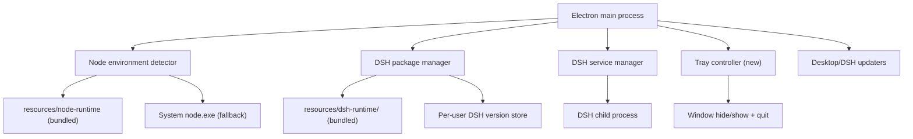

# DSH Desktop v0.2 Design: Zero-Friction Install, Faster Startup, Tray Resident

## 1. Summary

DSH Desktop v0.1 requires a system Node.js (`^22.19.0 || >=24.0.0`) and performs a
network npm install on first launch, which prevents some users from running the
app at all and makes first launch slow. v0.2 bundles a Node.js LTS runtime into
the installer, switches to an assisted NSIS wizard that lets users choose the
install directory, adds a system-tray resident mode where closing the window
hides the app (only the tray menu's "Exit" fully quits), and optimizes startup
latency.

## 2. Goals

- Every user can run the app after installation without installing Node.js.
- The installer stays fast: bundled runtimes ship as single-file archives so
  NSIS writes only a handful of large files instead of ~45,000 small ones.
- First launch reaches the DSH Web UI without any network install; the one-time
  runtime extraction shows progress in the startup window. After extraction,
  cold start reaches a usable DSH workspace in under ~5 seconds on a local
  machine; warm starts under ~3 seconds.
- Users choose the installation directory during setup.
- Closing the window hides the app to the system tray and keeps DSH running;
  quitting happens only through the tray context menu, which stops the complete
  DSH process tree before exiting.
- Keep all v0.1 behaviors intact when running in development or test mode.

## 3. Non-goals

- Repackaging Node.js into a portable app-internal copy that bypasses the
  official distribution; we ship the official `node-vX-win-x64` zip contents.
- Supporting macOS or Linux.
- Changing the DSH Web UI or its data formats.
- Auto-start with Windows login.
- First-run onboarding wizard beyond the existing startup progress window.
- Per-machine (admin) installation; installation remains per-user.

## 4. Confirmed Product Decisions

| Area | Decision |
| --- | --- |
| Node.js runtime | Bundle official Node.js LTS (`v24.15.0`, x64) inside the installer; fall back to a system Node.js when the bundled runtime is unavailable |
| Node.js version source | Single constant in `src/shared/config.ts`; prepare script downloads the zip from `https://nodejs.org/dist/` and verifies its SHA256 |
| Installer | Assisted NSIS wizard (`oneClick: false`) with `allowToChangeInstallationDirectory: true`, still `perMachine: false` |
| Tray behavior | Window close hides to tray (DSH keeps running); tray left-click toggles show/hide; tray right-click menu has "Exit" as the only full-quit path |
| First-hide notification | System notification on first hide: "DSH Desktop is still running; right-click the tray icon to fully exit" |
| DeepSeek tab | Preloads in the background as soon as the workspace window is shown |
| Dev/test mode | Environment-gated: tray-resident behavior disabled unless `DSH_DESKTOP_TRAY=1`; existing test and verify scripts keep working |

## 5. Runtime Architecture



### 5.1 Bundled Node.js runtime

- `scripts/prepare-node-runtime.ts` (new): downloads
  `node-v24.15.0-win-x64.zip` from nodejs.org into `.artifacts/node-runtime/`,
  verifies its SHA256 against the official `SHASUMS256.txt` from the same
  release directory, extracts it, and repackages it as a single
  `node-runtime-<version>.tar.gz` archive. Reuses the same idempotent pattern
  as `prepare-bundled-dsh.ts`.
- `scripts/prepare-bundled-dsh.ts` additionally emits
  `dsh-runtime-<version>.tar.gz` (single archive of the bundled DSH runtime)
  next to its extracted copy.
- `scripts/after-pack.cjs` copies only the two `.tar.gz` archives plus a
  `runtime-manifest.json` (schema 1, version, archive sha256, entries count)
  into `resources/` inside the packaged app, outside the asar. NSIS therefore
  writes a handful of large files instead of ~45,000 small ones.
- A new `src/main/platform/tar-extract.ts` module implements a minimal,
  dependency-free tar.gz extractor (Node `node:zlib` + tar header parsing)
  with path-traversal rejection. Build scripts create the archives with the
  Windows-bundled `tar.exe` (`tar -czf`), so no archive library is needed.
- First launch extracts each archive into the per-user data directory:
  - `dsh/node/<version>/` for the Node runtime,
  - `dsh/versions/<version>/` for the DSH runtime (reuses the existing version
    store and `current.json` pointer machinery).
  Extraction writes a `runtime-manifest.json` (schema 1, version, source
  archive sha256) and is skipped when a matching valid manifest already
  exists. Extraction failures are logged, the partial directory removed, and
  the fallback path (system Node, network install) is used.
- Node detection order in `node-environment.ts`:
  1. Extracted bundled runtime (`dsh/node/<version>` with valid manifest);
  2. System Node.js via `where.exe` (existing logic, unchanged).
- The returned `ValidNodeEnvironment` gains a `source: 'bundled' | 'system'`
  field so logs and the About dialog can show where Node came from.
- DSH updates keep using npm (`npm view`, `npm install`) but resolve
  `npmCliPath` from the same environment object, so a bundled Node supplies
  its own npm.
- The startup window gains a `preparing-runtime` phase (with progress detail)
  while archives are extracted on first launch.

### 5.2 Startup orchestration changes

- `StartupOrchestrator.runOnce()` becomes: detect Node environment (extract
  the bundled Node archive first when needed) → prepare the DSH runtime
  (extract the bundled DSH archive when no valid selection exists) → spawn
  `dsh web` → health check → show workspace. With both runtimes bundled,
  first launch performs zero network operations; later launches reuse the
  extracted copies and skip extraction entirely.
- Runtime validation results are cached per process (no repeated SHA256 work).
- The workspace window preloads the DeepSeek tab in the background as soon as
  `showDsh()` completes, instead of on first tab switch.

### 5.3 Assisted installer

`electron-builder.yml` changes:

```yaml
nsis:
  oneClick: false
  allowToChangeInstallationDirectory: true
  perMachine: false
  createDesktopShortcut: true
  createStartMenuShortcut: true
  shortcutName: DSH Desktop
```

- Users can pick any per-user writable directory. No UAC elevation is
  requested. Uninstaller removes the app and shortcuts.

### 5.4 Tray resident mode

New module `src/main/tray-controller.ts`:

- Creates a `Tray` with `build/icon.ico` and a context menu:
  - 显示 DSH 工作区 (show workspace, select `dsh` tab)
  - 显示 DeepSeek 对话 (show workspace, select `deepseek` tab)
  - 打开日志目录
  - separator
  - 退出 (quit)
- Left-click toggles the active window's visibility (show when hidden, hide
  when focused).
- Window close flow: on `close`, if tray mode is enabled the event is
  `preventDefault()`ed and the window is hidden; the first hide shows a native
  notification. In non-tray mode (dev/test or env var off) the current
  behavior is preserved.
- `window-all-closed` no longer quits when tray mode is enabled; quitting is
  only initiated by the tray menu, which runs the existing `before-quit`
  flow (stop DSH process tree → destroy windows → quit).
- Startup window follows the same close-to-hide behavior.
- Tray mode enabled only when `app.isPackaged` or `DSH_DESKTOP_TRAY=1`.

### 5.5 Version single-source cleanup

- `INITIAL_DSH_VERSION` and the new `BUNDLED_NODE_VERSION` live only in
  `src/shared/config.ts`.
- `scripts/prepare-bundled-dsh.ts` already reads `INITIAL_DSH_VERSION` from
  config; `scripts/after-pack.cjs` reads the pinned DSH version from the
  generated `.artifacts/bundled-dsh/<version>/runtime-manifest.json` instead
  of hardcoding `0.1.0-rc.6`.

## 5.6 Why v0.1 installs are slow, and what changes

v0.1's installer contains the bundled DSH runtime as ~30,000 loose files
under `resources/dsh-runtime/` (`scripts/after-pack.cjs` enforces
`descriptor.files >= 30_000`). NSIS extracts and writes every file
individually, so install time is dominated by small-file write overhead and
antivirus scanning, not by network or compression. v0.2 adds the Node runtime
(~15,000 more files), which would make the problem worse.

The fix: ship both runtimes as single `.tar.gz` archives and extract them on
first launch into the per-user data directory with a visible progress phase.
The installer then writes only the Electron app plus two large archive files.
First launch pays a one-time extraction cost (~10-30s on an SSD, shown in the
startup window); every later launch uses the cached extraction directly.

## 6. Error Handling

- Bundled Node archive missing/corrupt (hash mismatch): fall back to the
  system Node detection path; if that also fails, the existing
  `environment-error` screen with `open-node-download` action is shown
  (unchanged).
- Archive extraction failure: remove the partial directory, log the error,
  and use the fallback path (system Node for the runtime, network npm
  install for DSH).
- Node download/extract failure during build: the prepare script fails the
  build with a clear message (no silent partial bundle).
- Tray creation failure (rare): log and continue without tray; window close
  then behaves like non-tray mode.

## 7. Testing

- Unit tests:
  - `tar-extract.spec.ts`: round-trip extraction (create with `tar.exe`,
    extract with the module), path-traversal rejection, gzip stream errors.
  - `node-environment.spec.ts`: bundled-first priority, fallback to system,
    extracted manifest hash validation.
  - `tray-controller.spec.ts` (or equivalent): close→hide flow, quit stops
    the service, first-hide notification fires once.
  - `builder-config.spec.ts`: assert `oneClick: false` and
    `allowToChangeInstallationDirectory: true`.
  - `app-paths.spec.ts` / config: single-source version constants.
- Integration:
  - `verify:real-dsh` extended (or a new `verify:bundled-node` script) to run
    against the extracted bundled Node runtime with the system PATH stripped
    of Node, proving a Node-less machine works.
  - Archive round-trip: build script output is re-extracted by the app module
    in a test fixture.
- Manual checklist:
  - Assisted install with custom directory; app launches on a Node-less VM;
  - Installer completes quickly (no multi-minute small-file writes);
  - First launch shows runtime-extraction progress, then reaches DSH UI
    without network install; second launch skips extraction;
  - Close window → tray icon present, DSH still healthy; tray Exit → DSH
    process tree gone and app fully quit;
  - Dev mode (`npm run dev`) keeps old close-to-quit behavior.

## 8. Versioning

- Bump `package.json` to `0.2.0`. Breaking behavioral change (close no longer
  quits) justifies a minor bump; installer format changes too.
